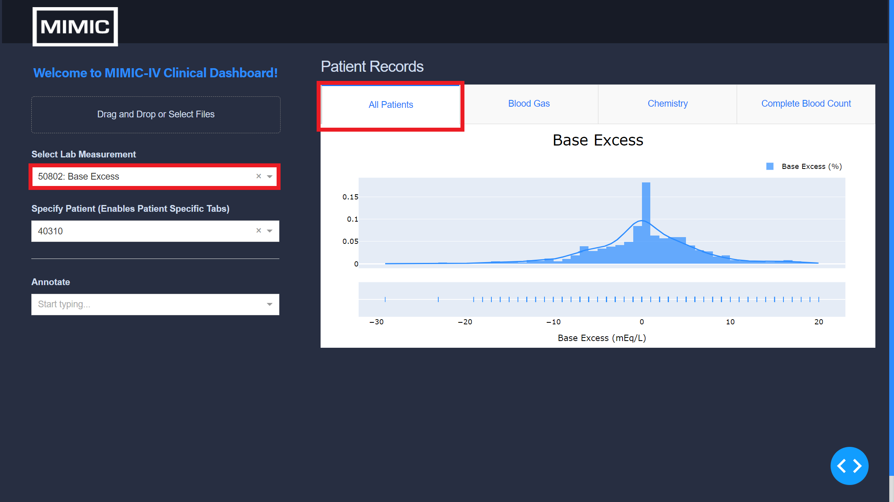
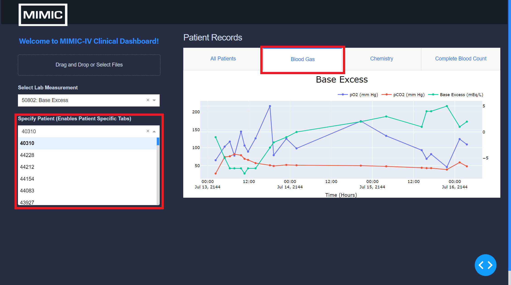
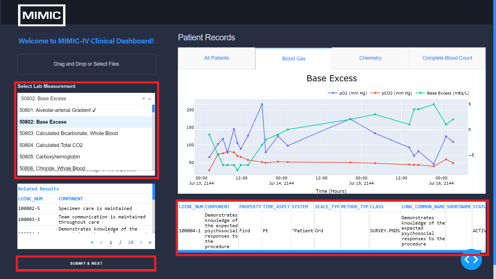
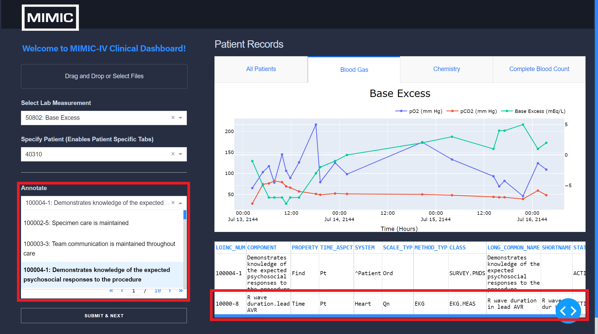

<div id="top"></div>

[](https://colab.research.google.com/)


[](https://zenodo.org/badge/latestdoi/490904949)

<!-- PROJECT LOGO -->
<br />
<div align="center">
    

  <h3 align="center">MIMIC-IV Clinical Dashboard</h3>

  <p align="center">
Dashboard for Clinical Terminology Annotations    <br />
    (Supports LOINC®, SNOMED-CT)
  </p>
</div>


<!-- TABLE OF CONTENTS -->
<details>
  <summary>Table of Contents</summary>
  <ol>
    <li>
      <a href="#about">About</a>
    </li>
    <li>
      <a href="#getting-started">Getting Started</a>
      <ul>
        <li><a href="#requirements">Prerequisites</a></li>
        <li><a href="#installation">Installation</a></li>
      </ul>
    </li>
    <li><a href="#usage">Usage</a></li>
    <li><a href="#demo-data">Demo Data</a></li>
    <li><a href="#license">License</a></li>
    <li><a href="#acknowledgments">Acknowledgments</a></li>
</ol>
</details>


<!-- ABOUT THE PROJECT -->
## About
...

Demo deployed on [https://mimic-iv-dash-demo.herokuapp.com](https://mimic-iv-dash-demo.herokuapp.com).

<p align="right">(<a href="#top">back to top</a>)</p>


<!-- GETTING STARTED -->
## Getting Started

...


<p align="right">(<a href="#top">back to top</a>)</p>


### Requirements

The dashboard requires the following to run:

* [Dash][dash]~=2.6.0
* [Pandas][pandas]~=1.4.2
* [Plotly][plotly]~=5.8.0
* [NumPy][numpy]~=1.22.3
* [PyYAML][pyyaml]~=6.0
* [SciPy][scipy]~=1.7.3

All packages are listed in ```requirements.txt```.


<p align="right">(<a href="#top">back to top</a>)</p>


### Installation

Clone:
   ```sh
   git clone https://github.com/justin13601/mimic-iv-dash.git
   ```

<p align="right">(<a href="#top">back to top</a>)</p>


## Usage

```
python3 app.py
```

Files required:

* A .csv file containing all patient observations/data (missingness allowed):
  ```
  itemid,subject_id,charttime,value,valueuom
  52038,123,2150-01-01 10:00:00,5,mEq/L
  52038,123,2150-01-01 11:00:00,6,ug/mL
  ...
  ```
* A .csv file containing all concepts to be annotated in id-label pairs, {id: label}:
  ```
  itemid,label
  52038,Base Excess
  52041,pH
  ...
  ```
* The config.yaml:
    * Define results directory (default: /results-json)
    * Define data directory (default: /demo-data)
    * Define concepts directory (default: /demo-data)
    * Define ontology SQLite3 directory (default: /ontology)
    * Define up to 3 pairs of lab measurements to plot annotations against (defaults vary for lab/chart events)

|           |           |
|-----------------------------------|-----------------------------------|
|  |  |


<p align="right">(<a href="#top">back to top</a>)</p>

## Demo Data
Demo data and respective licenses are included in the [demo-data folder](/demo-data).

- MIMIC-IV Clinical Database demo is available on Physionet (Johnson, A., Bulgarelli, L., Pollard, T., Horng, S., Celi, L. A., & Mark, R. (2022). MIMIC-IV Clinical Database Demo (version 1.0). PhysioNet. https://doi.org/10.13026/jwtp-v091).

- LOINC® Ontology Codes are available at https://loinc.org.

- SNOMED-CT Ontology Codes are available at https://www.nlm.nih.gov/healthit/snomedct/index.html.


<p align="right">(<a href="#top">back to top</a>)</p>

<!-- LICENSE -->
## License

Distributed under the [MIT][mit] License.

<p align="right">(<a href="#top">back to top</a>)</p>


<!-- ACKNOWLEDGMENTS -->
## Acknowledgments

* Alistair Johnson, DPhil | The Hospital for Sick Children | Scientist
* Mjaye Mazwi, MBChB, MD | The Hospital for Sick Children | Staff Physician
* Danny Eytan, MD, PhD | The Hospital for Sick Children | Staff Physician
* Oshri Zaulan, MD | The Hospital for Sick Children | Staff Intensivist
* Azadeh Assadi, MN | The Hospital for Sick Children | Pediatric Nurse Practitioner


<p align="right">(<a href="#top">back to top</a>)</p>


[dash]: https://dash.plotly.com/installation

[pandas]: https://pandas.pydata.org/docs/getting_started/install.html

[plotly]: https://plotly.com/python/getting-started/

[numpy]: https://numpy.org/install/

[pyyaml]: https://pyyaml.org/wiki/PyYAMLDocumentation

[scipy]: https://scipy.org/install/

[mit]: https://opensource.org/licenses/MIT