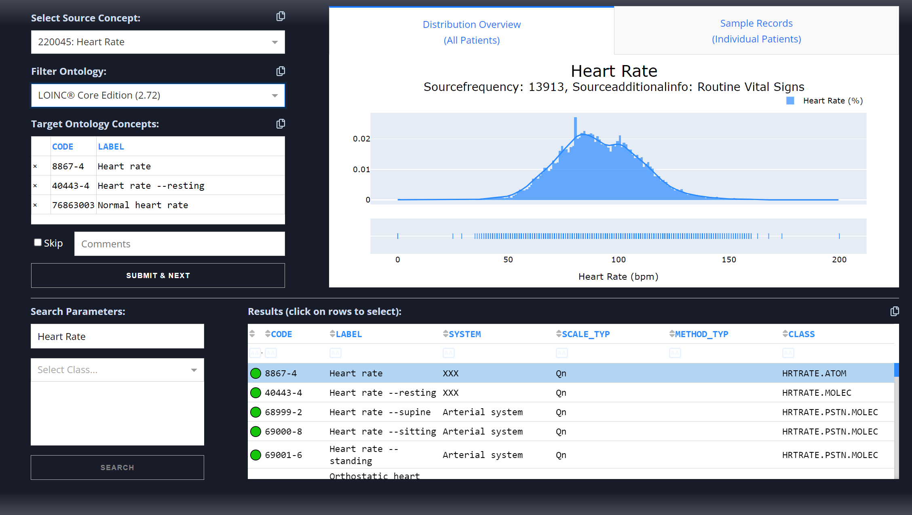

<div id="top"></div>

[](https://colab.research.google.com/)

[](https://zenodo.org/badge/latestdoi/490904949)

<!-- PROJECT LOGO -->
<br />
<div align="center">
    

<h3 align="center">MIMIC-IV Clinical Dashboard</h3>

  <p align="center">
Dashboard for Clinical Terminology Annotations    <br />
    (Supports LOINC®, SNOMED-CT)
  </p>
</div>


<!-- TABLE OF CONTENTS -->
<details>
  <summary>Table of Contents</summary>
  <ol>
    <li>
      <a href="#about">About</a>
    </li>
    <li>
      <a href="#getting-started">Getting Started</a>
      <ul>
        <li><a href="#requirements">Requirements</a></li>
        <li><a href="#installation">Installation</a></li>
      </ul>
    </li>
    <li><a href="#usage">Usage</a></li>
    <li><a href="#demo-data">Demo Data</a></li>
    <li><a href="#license">License</a></li>
    <li><a href="#acknowledgments">Acknowledgments</a></li>
</ol>
</details>


<!-- ABOUT THE PROJECT -->

## About

MIMIC-Dash is a deployable clinical terminology annotation dashboard developed primarily in Python using Plotly Dash. It
allows users to annotate concepts/items on a straightforward interface supported by visualizations of associated
patient data and natural language processing algorithms.

The dashboard seeks to provide a flexible and customizable solution for clinical annotation. Extensions, such as machine
learning-powered plugins and search algorithms, can be easily added.

The latest demo with ```chartevents``` & ```d_items``` from the MIMIC-IV v2.0 ```icu``` module loaded is deployed on
Heroku [here](https://mimic-iv-dash-v2.herokuapp.com/) and on Google App Engine [here](https://mimic-dash-dot-kind-lab.nn.r.appspot.com/).

Featured on [Plotly & Dash 500](https://www.linkedin.com/posts/dave-gibbon-8a6219_python-plotly-dash-activity-6993654939717689344-pYrw)!

#### Overview


The top left of the dashboard features a section that keeps track of to-be annotated items and target ontology codes for
the user. Top right contains the data visualization component. The bottom half includes components dedicated to querying
and displaying ontology codes.

#### Data Visualization

|        |         |
|------------------------------------|-------------------------------------|

The dashboard is supported by visualization of relevant patient data. For any given target item, patient observations
are queried from the source data. The ```Distribution Overview``` tab contains a distribution summarizing all patient
observations. ```Sample Records``` selects the top 5 patients (as ranked by most observations) and displays their
records over a 96-hour window. Both numerical and text data are supported.

#### Annotation

The user annotates target items by first selecting the to-be annotated item in the first dropdown. The following
dropdown allows users to select the target ontology (LOINC® or SNOMED-CT). Code suggestions are then generated in the
bottom table. Users are able to select their target annotation and by submitting, the appropriate data is saved
in ```.json``` files.

#### Ontology Search

The dashboard automatically generates ontology code suggestions based on the target item. A string search supported by
PyLucene and the Porter stemming algorithm sorts results by relevance, as indicated by the colour of the circles.
Several other methods of string search are available, such as FTS5 in SQLite3, TF-IDF, Jaro-Winkler, and Fuzzy partial
ratio.

<p align="right">(<a href="#top">back to top</a>)</p>
<!-- GETTING STARTED -->

## Getting Started

Below are steps to download, install, and run the dashboard locally. Leave all configuration fields the same to run the demo.

### Requirements

The dashboard requires the following major packages to run:

* [Dash][dash]~=2.6.0
* [Pandas][pandas]~=1.4.2
* [Plotly][plotly]~=5.8.0
* [NumPy][numpy]~=1.22.3
* [PyYAML][pyyaml]~=6.0
* [SciPy][scipy]~=1.7.3

All other packages are listed in ```requirements.txt```.

Additionally, the latest version of the dashboard requires PyLucene for its primary ontology code searching algorithm.
Please follow setup instructions available [here](https://lucene.apache.org/pylucene/install.html).


<p align="right">(<a href="#top">back to top</a>)</p>

### Installation

1. Clone repository:
   ```sh
   git clone https://github.com/justin13601/mimic-iv-dash.git
   ```

2. Install requirements:
   ```sh
   pip install -r requirements.txt
   ```

3. Install PyLucene and associated Java libraries.
    ```sh
    # shell script to install jcc and pylucene
    ```

4. Edit ```/src/generate_config.py``` with desired directories and configurations and run:
    ```sh
   python3 generate_config.py
    ```
   This creates the ```config.yaml``` required by the dashboard.

<p align="right">(<a href="#top">back to top</a>)</p>

## Usage

Run app and visit http://127.0.0.1:8888/:

   ```sh
   python3 app.py
   ```

#### Required Files:

* A ```.csv``` file containing all patient observations/data (missingness allowed, except for the ```itemid``` column):
  ```
  itemid,subject_id,charttime,value,valueuom
  52038,123,2150-01-01 10:00:00,5,mEq/L
  52038,123,2150-01-01 11:00:00,6,ug/mL
  ...
  ```
* A ```.csv``` file containing all concepts to be annotated in id-label pairs, {id: label}:
  ```
  itemid,label
  52038,Base Excess
  52041,pH
  ...
  ```
* The ```config.yaml```:
    * Define results directory (default: ```/results-json/demo```)
    * Define location of the source data ```.csv``` (default: ```/demo-data/CHARTEVENTS.csv```)
    * Define location of the concepts ```.csv``` (default: ```/demo-data/demo_chartevents_user_1.csv```)
    * Define location of ontology SQLite3 databases (default: ```/ontology```)
    * Define string search algorithm (default: ```pylucene```)
    * Define dashboard aesthetics for graphs (defaults are shown in the configuration file)

#### Other Relevant Files

```/src/generate_config.py``` is used to generate the ```config.yaml``` file.

```/src/generate_ontology_database.py``` uses SQLite3 to generate the ```.db``` database files used to store the
ontology
vocabulary.

```/src/generate_pylucene_index.py``` is used to generate the index used by PyLucene for ontology querying.

```/src/search.py``` includes classes for ontology searching.

<p align="right">(<a href="#top">back to top</a>)</p>

## Demo Data

Demo data and respective licenses are included in the [demo-data folder](/demo-data).

- MIMIC-IV Clinical Database demo is available on Physionet (Johnson, A., Bulgarelli, L., Pollard, T., Horng, S., Celi,
  L. A., & Mark, R. (2022). MIMIC-IV Clinical Database Demo (version 1.0).
  PhysioNet. https://doi.org/10.13026/jwtp-v091).

- LOINC® Ontology Codes are available at https://loinc.org.

- SNOMED-CT Ontology Codes are available at https://www.nlm.nih.gov/healthit/snomedct/index.html.

<p align="right">(<a href="#top">back to top</a>)</p>

<!-- LICENSE -->

## License

Distributed under the [MIT][mit] License.

<p align="right">(<a href="#top">back to top</a>)</p>


<!-- ACKNOWLEDGMENTS -->

## Acknowledgments

* Alistair Johnson, DPhil | The Hospital for Sick Children | Scientist
* Mjaye Mazwi, MBChB, MD | The Hospital for Sick Children | Staff Physician
* Danny Eytan, MD, PhD | The Hospital for Sick Children | Staff Physician
* Oshri Zaulan, MD | The Hospital for Sick Children | Staff Intensivist
* Azadeh Assadi, MN | The Hospital for Sick Children | Pediatric Nurse Practitioner

<p align="right">(<a href="#top">back to top</a>)</p>


[dash]: https://dash.plotly.com/installation

[pandas]: https://pandas.pydata.org/docs/getting_started/install.html

[plotly]: https://plotly.com/python/getting-started/

[numpy]: https://numpy.org/install/

[pyyaml]: https://pyyaml.org/wiki/PyYAMLDocumentation

[scipy]: https://scipy.org/install/

[mit]: https://opensource.org/licenses/MIT
